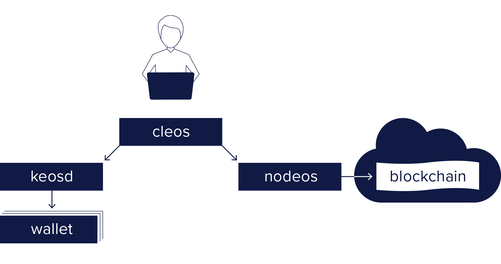

The Channel is the human-first blockchain platform for creating and deploying smart contracts and distributed applications, built by Tetra Grids on the Spring 2.0 (Antelope) core. The Channel comes with a number of programs. The primary ones included in The Channel are the following:

* [Channeld](01_channeld/index.md) - Core service daemon that runs a node for block production, API endpoints, or local development.
* [Chan](02_chan/index.md) - Command line interface to interact with the blockchain (via `channeld`) and manage wallets (via `keyd`).
* [Keyd](03_keyd/index.md) - Component that manages Channel keys in wallets and provides a secure enclave for digital signing.

The basic relationship between these components is illustrated in the diagram below.

Additional Channel Resources:
* [Channel Utilities](10_utilities/index.md) - Utilities that complement The Channel software.  

[//]: # (THIS IS A COMMENT REMOVING BROKEN LINKS)  
[//]: # (Upgrade-Guide-20_upgrade-guide/index.md-antelope-version/protocol-upgrade-guide.)  
[//]: # (Release Notes 30_release-notes/index.md  - All release notes for this Channel version.)  

[[info | What's Next?]]
| [Install The Channel Software](00_install/index.md) before exploring the sections above.
